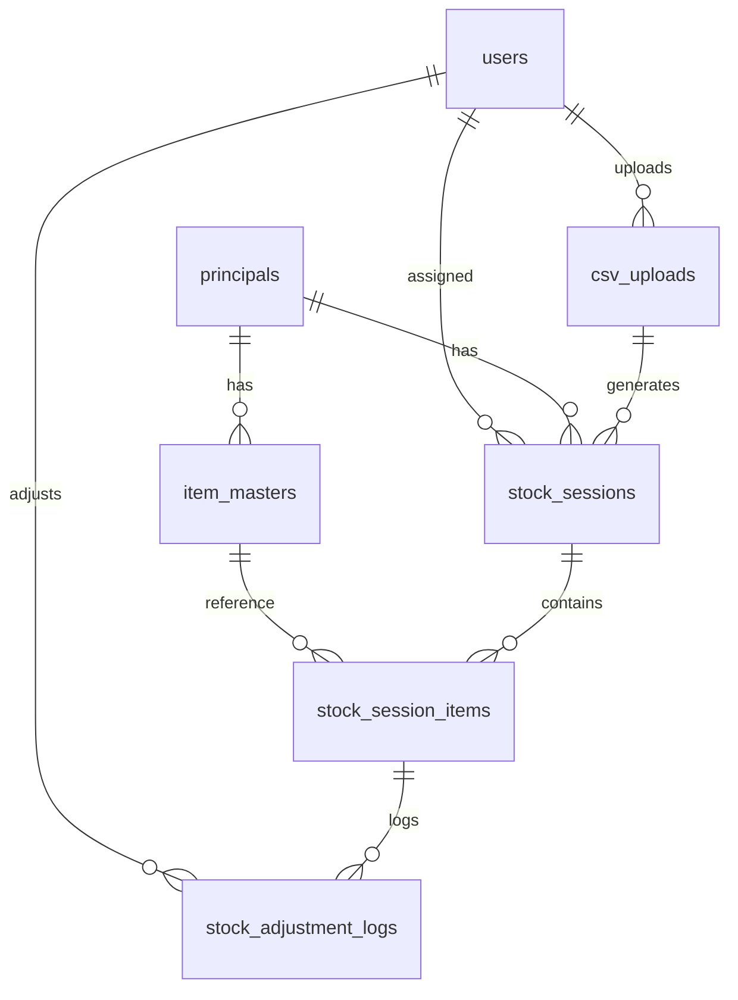

# Session Handover

> **Tanggal:** 2026-07-16
> **Project:** Distora Stock — Aplikasi Stock Opname

---

## Current State

Proyek dalam tahap **Alpha** — fitur inti stock opname (CSV import → generate session → barcode scanning → record qty → selisih → adjustment log) sudah berfungsi dan sudah ter-test.

Yang masih kurang:
1. **Reporting UI** — Service logic sudah ada, Filament page belum
2. **User Management** — Tidak ada UI untuk manage users (CRUD user + assign role)
3. **Database Seeder** — Tidak ada data awal, perlu bikin admin via tinker manual

---

## Technical Context

### Environment
- **OS:** Windows (XAMPP)
- **PHP:** ^8.2
- **Database:** SQLite (default), MySQL juga di-support
- **Node:** required untuk Vite

### Running the App
```bash
cd C:\xampp\htdocs\distora-stock\backend
composer run dev
```
Atau akses langsung via browser ke `http://localhost/distora-stock/backend/public/admin`

### Key Files
| File | Purpose |
|---|---|
| `backend/app/Services/CsvImportService.php` | Parse & sync CSV ke database |
| `backend/app/Services/StockSessionService.php` | Generate & manage sessions |
| `backend/app/Services/StockScanningService.php` | Barcode scanning & qty recording |
| `backend/app/Services/ReportService.php` | Report & CSV export (no UI yet) |
| `backend/app/Filament/Pages/StockScanning.php` | Scanning page logic |
| `backend/resources/views/filament/pages/stock-scanning.blade.php` | Scanning page view |

### Database


---

## Next Steps (Recommended Order)

1. **Create User Management UI** — Filament Resource for users + seeder
2. **Create Report Page** — Filament page with session report, selisih report, daily summary, CSV download
3. **Add Input Validation** — qtyLevels validation on scan page
4. **Add Session Complete Confirmation** — modal/notification
5. **Dashboard Widgets** — today's sessions summary, recent selisih items
6. **REST API** — if mobile app is planned

---

## Known Issues / Gotchas

1. **CSV Column Names** — The CSV parser expects specific column names: `Principle#`, `Principle Description`, `Item#`, `Item Description`, `Size`, `OnHand`, `OnHand Base`. Note: "Principle" (typo) is intentional — it matches the actual CSV file.
2. **Conversion Factors** — Parsed from item name using regex `\(1X(\d+)(?:X(\d+))?\)`. Only works if the format is exactly "(1X...)" — no other patterns supported yet.
3. **Barcode Matching** — `findByBarcode()` first tries `item_masters.barcode`, then falls back to matching by `kode_barang` directly in session items.
4. **Session Date** — Scan page only shows sessions for `today()`. No way to work on past-dated sessions.
5. **Queue** — Queue worker is configured but no jobs are queued yet (everything runs synchronously in transactions).
6. **No Soft Deletes** — All records are hard-deleted.

---

## Contact / Ownership

- **Project Owner:** Distora
- **Developer:** (unknown — project is built by AI/multiple contributors)
- **Repository:** Internal, no remote configured yet
