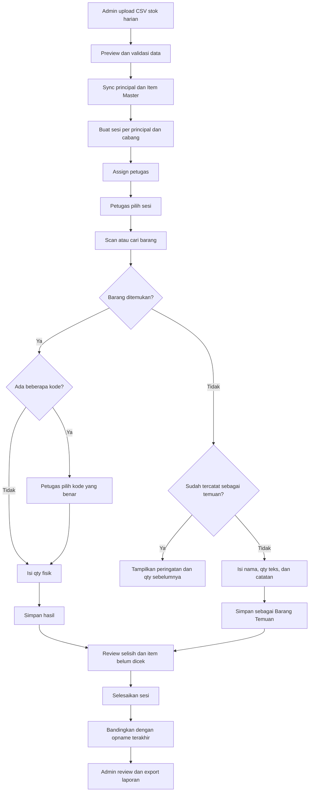
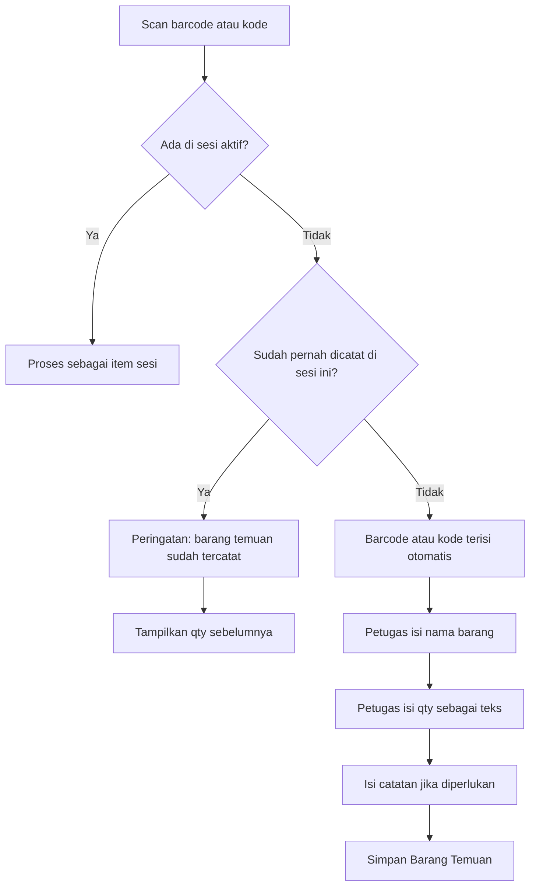
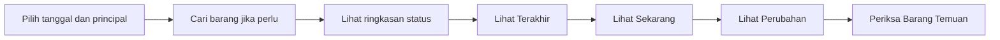

# Alur Stock Opname Distora Stock

Dokumen ini menjelaskan alur kerja admin dan petugas stok dari persiapan data
sampai pemeriksaan laporan.

## Ringkasan Alur



## Alur Admin

1. Buka menu **Upload Stok Harian**.
2. Upload CSV stok dan periksa preview.
3. Jalankan sinkronisasi untuk memperbarui principal dan Item Master.
4. Sistem membuat sesi stock opname berdasarkan principal dan cabang.
5. Assign petugas ke sesi yang sesuai.
6. Setelah opname selesai, buka **Laporan** untuk review dan export.

Admin pusat dapat melihat seluruh cabang. Admin cabang hanya dapat mengelola
data cabangnya.

## Alur Petugas Stok

1. Buka menu **Scan Barcode**.
2. Pilih principal atau sesi yang akan dikerjakan.
3. Scan barcode atau gunakan kolom pencarian.
4. Kolom pencarian menerima barcode, kode barang, atau nama barang.
5. Jika satu barcode cocok dengan beberapa kode, pilih item yang benar.
6. Isi qty fisik lalu simpan.
7. Gunakan panel berikut untuk pemeriksaan:
   - **Item Selisih** untuk koreksi qty.
   - **Barang Temuan** untuk barang yang tidak ada di sesi.
   - **Sudah Dicek** untuk melihat semua hasil pemeriksaan.
   - **Belum Dicek** untuk mencari pekerjaan yang tersisa.
   - **Perbandingan** untuk membandingkan hasil dengan opname terakhir.
8. Tekan **Selesaikan Sesi** setelah pemeriksaan selesai.

Daftar barang otomatis diurutkan berdasarkan kode A-Z. Panel dapat dibuka dan
ditutup agar halaman tetap ringkas di HP.

## Qty Fisik

Qty item yang ada di sesi mengikuti struktur satuan Item Master, misalnya
`CTN-PCK-PCS`.

Untuk Barang Temuan, qty ditulis bebas sebagai teks oleh petugas, misalnya:

```text
1 CTN 1 PCK 1 PCS
```

Sistem menyimpan teks tersebut agar hasil hitung mudah dibaca. Petugas tidak
perlu mengubah semuanya menjadi PCS.

## Alur Barang Temuan



Ketentuan Barang Temuan:

- Barcode atau kode berasal dari hasil scan dan terisi otomatis.
- Nama barang diisi manual jika tidak ada di Item Master.
- Qty fisik diisi manual sebagai teks.
- Catatan bersifat opsional.
- Barcode atau kode yang sama tidak dapat dicatat dua kali dalam satu sesi.
- Barang Temuan tidak otomatis dimasukkan ke Item Master.

## Perbandingan Opname

Perbandingan memakai sesi stock opname terakhir untuk principal dan cabang
yang sama, bukan otomatis memakai hari sebelumnya.

| Status | Arti |
|---|---|
| Baru Selisih | Sebelumnya tidak selisih, sekarang menjadi selisih |
| Selisih Memburuk | Besar selisih bertambah buruk |
| Selisih Membaik | Besar selisih berkurang |
| Sudah Normal | Selisih sebelumnya sudah tidak ada |

Filter **Baru / Memburuk** menggabungkan dua kondisi yang perlu perhatian
petugas. Label pada setiap item tetap menunjukkan status aslinya.

## Laporan Petugas

Laporan petugas dibuat khusus untuk layar HP dan hanya berisi:

- Pilihan tanggal stock opname dan principal.
- Pencarian kode atau nama barang.
- Ringkasan Baru/Memburuk, Membaik, dan Barang Temuan.
- Kartu perbandingan berisi nilai Terakhir, Sekarang, dan Perubahan.
- Daftar Barang Temuan beserta qty.

Petugas tidak melihat tabel desktop yang lebar atau menu export CSV. Fitur
laporan lengkap dan export tetap tersedia untuk admin.



## Catatan Operasional

- Kamera HP memerlukan akses HTTPS melalui tunnel.
- Jika kamera tidak tersedia, barcode, kode, atau nama barang dapat diketik.
- Jangan menutup aplikasi, MySQL, atau tunnel ketika opname berlangsung.
- Jika koneksi terganggu, periksa daftar **Sudah Dicek** sebelum mengulang input.
